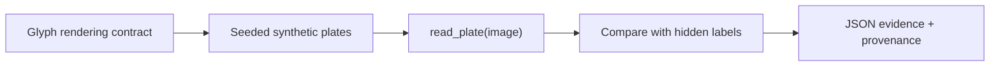

# Mercosul License Plate OCR: Contract-First Pipeline Skeleton

**`1.000000` character accuracy** on `700` characters from `100` seeded synthetic Mercosul plates, read from image pixels only. This is a correctness gate for the pipeline contract, not a real-road accuracy claim.

[](https://github.com/Brilhante29/alpr-mercosul/actions/workflows/validate.yml)
[](LICENSE)


> Real-world plate recognition was the subject of my peer-reviewed paper ([ISDA 2022 proceedings, Springer LNNS 715, 2023](https://doi.org/10.1007/978-3-031-35507-3_4)), which used deep learning with perspective adjustment. This repository isolates the part that must stay correct no matter which model sits inside: the format contract, the image-only reader boundary, and evaluation that never sees ground truth before prediction.

## Why this exists

ALPR projects usually jump straight to a detector and report accuracy on whatever images were at hand. The failure modes that hurt in production are more mundane: a reader that accidentally receives the label, a plate string that is not a valid Mercosul format, or an evaluation that cannot be rerun bit for bit. This repository pins those down first:

- `read_plate(image) -> str` is the only boundary between the image and the evaluator;
- plates follow the Mercosul pattern `LLL1L23` (three letters, a digit, a letter, two digits), validated on both sides of the boundary;
- a negative test swaps one glyph in the image while keeping the expected label, and proves the prediction follows the pixels, not the label;
- the fixture is seeded and versioned, so any change in accuracy is a change in code.

## Results

| Metric | Value | Workload |
|---|---:|---:|
| Character accuracy | 1.000000 | 700 characters |
| Full-plate accuracy | 1.000000 | 100 plates |
| Incorrect plates | 0 | 100 plates |

The workload renders 100 seeded plates at 200x80 with 800 controlled dark-noise pixels each. A fixed-layout template matcher predicts seven characters per image, and ground truth is consulted only after prediction.

A perfect score is the expected outcome on clean synthetic glyphs, which is exactly why it works as a regression gate: any drop means the contract broke. It says nothing about blur, perspective, lighting, or real cameras.

## Quickstart

```bash
docker build -t alpr-mercosul .
docker run --rm alpr-mercosul
```

| Command | Purpose |
|---|---|
| `alpr-mercosul demo --n-plates 5 --seed 42` | Show expected labels next to image-derived predictions |
| `alpr-mercosul benchmark --n-plates 100 --seed 42 --output benchmarks/results/baseline.json` | Produce raw V1 evidence |
| `./tools/publish-benchmark.ps1` | Build the image and produce V1 plus provenance-rich V2 evidence |
| `./tools/validate-project.ps1` | Run project, test, content, and Docker gates |

## How it works



| Module | Responsibility |
|---|---|
| `rendering.py` | Plate geometry, glyph rendering, `LLL1L23` validation |
| `fixture.py` | Seeded plate generation with controlled noise |
| `ocr.py` | Image-only template matching behind `read_plate` |
| `domain.py` | Immutable plate results and accuracy arithmetic |
| `benchmark.py`, `cli.py` | Orchestration, evidence, and transport |

## Design decisions

| Decision | Why | Rejected |
|---|---|---|
| Template matching inside a stable boundary | Makes the contract testable without GPU, weights, or datasets | Shipping a detector before the contract is pinned |
| Synthetic seeded fixture | Reproducible and free of personal data (plates identify vehicles and owners) | Scraped road images |
| Single image-to-string port | A neural reader can replace the matcher without touching evaluation | Coupling the evaluator to a model framework |

## Limitations

- No vehicle detection, plate localization, perspective correction, or real-road generalization.
- One font and one fixed layout; the matcher would fail on real plates by design.
- One publication run (`repeat=1`) over 100 plates (`measured_iterations=100`).

## Reproducibility

- Workload config: [`benchmarks/config/alpr-synthetic-v1.json`](benchmarks/config/alpr-synthetic-v1.json).
- Raw result: [`benchmarks/results/baseline.json`](benchmarks/results/baseline.json).
- V2 result: [`benchmarks/publication/alpr-baseline-v2.json`](benchmarks/publication/alpr-baseline-v2.json), clean source commit `b23be43`, image digest `sha256:399b8ba8e00b4855fb0d7605682899a7b02345b3e31237a7755aa97f8f748e37`.
- Runtime pins: `requirements.txt` and the Docker base digest.

## Project structure

```text
src/alpr_mercosul/   rendering contract, fixture, OCR, domain, benchmark, CLI
tests/               OCR, domain, benchmark, and publication-contract tests
benchmarks/          workload config, raw results, V2 publication evidence
tools/               evidence producer and validators
sdd/  openspec/      specification, architecture and technical decisions
```

## How this repository is built

The project follows the spec-driven workflow of [portfolio-reuse-kit](https://github.com/Brilhante29/portfolio-reuse-kit). Requirements and decisions live in [`sdd/`](sdd) and [`openspec/`](openspec), and [`project.yaml`](project.yaml) records the architecture, stack, and rejected alternatives. Development is AI-assisted and human-governed: [`AGENTS.md`](AGENTS.md) and [`CLAUDE.md`](CLAUDE.md) hold the coding-agent instructions, while tests, validators, and CI decide what gets published.

## Related work

- [New Approach in LPR Systems Using Deep Learning to Classify Mercosur License Plates with Perspective Adjustment](https://doi.org/10.1007/978-3-031-35507-3_4), ISDA 2022 proceedings, Springer LNNS 715, 2023 (co-author).
- [yolo-training-pipeline](https://github.com/Brilhante29/yolo-training-pipeline) and [vision-serving-fastapi](https://github.com/Brilhante29/vision-serving-fastapi): the training and serving side of a detector-based reader.

See [`REFERENCES.md`](REFERENCES.md) for library and format attribution.

## Author

**Guilherme Brilhante**, software engineer working on scalable backends and production AI.
[LinkedIn](https://www.linkedin.com/in/guilhermefreirebrilhanteseveriano/) · [GitHub](https://github.com/Brilhante29) · [Publications](https://dblp.org/pid/353/6812.html)

## License

[MIT](LICENSE).
